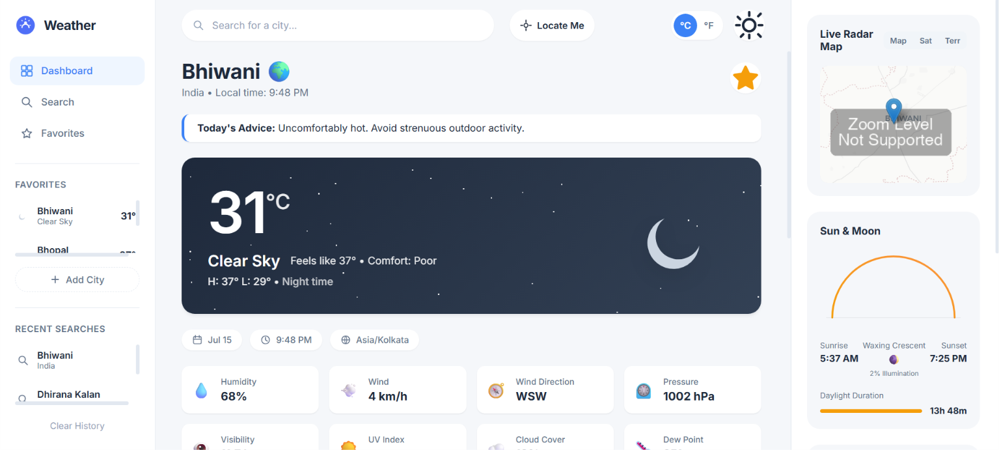
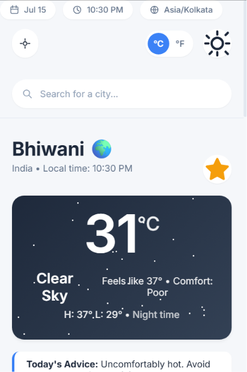
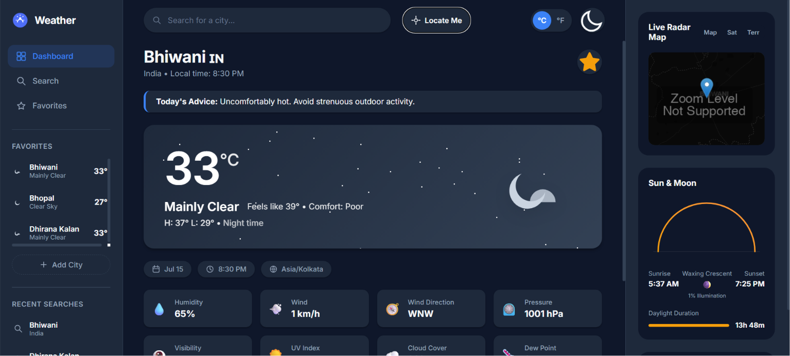
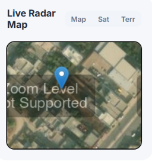

<div align="center">

# ⛅ Weather — Premium Global Weather Dashboard

### A modern weather experience with real-time forecasts, air quality insights, interactive radar maps, and worldwide weather support.

<br/>

[](https://weatherverse.vercel.app)
[](https://github.com/AshishJangra2508/Weatherverse)

<br/>

<!-- Tech Stack Badges -->
[](#)
[](#)
[](#)
[](#)
[](#)
[](#)

<!-- Feature Badges -->
[](#-license)
[](#)
[](#)
[](#)
[](#)
[](#)
[](#)
[](#)
[](#)
[](#)
[](#)

</div>

---

## 🔗 Quick Links

| Resource | Link |
|:---------|:-----|
| 🌐 **Live Demo** | [weatherverse.vercel.app](https://weatherverse.vercel.app) |
| 📦 **Repository** | [github.com/AshishJangra2508/Weatherverse](https://github.com/AshishJangra2508/Weatherverse) |
| 👨‍💻 **Developer** | [Ashish Jangra](https://github.com/AshishJangra2508) |

---

## 📸 Project Preview

<div align="center">
  <!-- Replace with your actual screenshots -->
  
  <br/>
  <em>Desktop Dashboard — Three-panel layout with sidebar, main dashboard, and utility panel</em>
  <br/><br/>

  <p align="center">
    
    &nbsp;&nbsp;&nbsp;&nbsp;
    
    &nbsp;&nbsp;&nbsp;&nbsp;
    
  </p>
  <em>Mobile View · Dark Mode · Radar Maps</em>
</div>

> 💡 **Tip:** Screenshots coming soon. To preview the app, visit the [Live Demo](https://weatherverse.vercel.app) or clone and run locally.

---

## ✨ Features

| Category | Feature | Description |
|:---------|:--------|:------------|
| 🌍 | **Worldwide City Search** | Precise location search powered by OpenStreetMap Nominatim geocoding |
| 📍 | **Current Location Detection** | One-tap GPS-based weather for your exact coordinates |
| ⏱️ | **Real-Time Weather** | Up-to-the-minute atmospheric conditions from WMO-standard models |
| 📅 | **Hourly & 7-Day Forecasts** | Detailed short-term and long-term forecasts with precipitation, wind, and UV data |
| 🍃 | **Air Quality Index** | Comprehensive AQI monitoring with PM2.5, PM10, CO, NO₂, and O₃ breakdowns |
| 🌅 | **Sunrise & Sunset** | Dynamic daylight arc visualization with astronomical calculations |
| 🎨 | **Dynamic Backgrounds** | CSS particle animations (rain, snow, stars) that react to live weather |
| 🌓 | **Dark & Light Mode** | Beautifully crafted dual themes for comfortable day and night usage |
| ⭐ | **Favorites Management** | Save and instantly access your most important locations |
| 🕒 | **Recent Searches** | Quick-access history with command-palette style dropdown |
| 🗺️ | **Live Weather Radar** | Interactive Leaflet maps with satellite, terrain, and precipitation overlays |
| 📱 | **Progressive Web App** | Fully installable on Desktop, iOS, and Android devices |
| 📶 | **Offline Support** | Service Worker caching strategies for network-independent access |
| 💻 | **Responsive Design** | Flawless experience across mobile, tablet, and ultra-wide screens |
| ⏳ | **Skeleton Loading** | Premium perceived performance with shimmer animations during data fetch |
| ⚠️ | **Weather Alerts** | Intelligent, locally generated warnings for severe conditions |
| 🛋️ | **Comfort Index** | Actionable health and clothing insights based on heat index and humidity |
| 🌡️ | **Unit Toggle** | Seamless switching between Celsius and Fahrenheit |

---

## 🛠️ Tech Stack

<div align="center">

| Layer | Technology |
|:------|:-----------|
| **Structure** | HTML5, Semantic Markup |
| **Styling** | CSS3 (Grid, Flexbox, Custom Properties, Animations) |
| **Logic** | JavaScript ES6+ (Modular Architecture) |
| **Mapping** | Leaflet.js, OpenStreetMap, RainViewer |
| **Weather Data** | Open-Meteo API (Weather & AQI) |
| **Geocoding** | Nominatim (OpenStreetMap) |
| **PWA** | Service Workers, Web App Manifest, Cache API |
| **Deployment** | Vercel, GitHub Pages |
| **Version Control** | Git, GitHub |

</div>

---

## 📂 Project Architecture

The application follows a highly modular ES6 architecture with clear separation of concerns, ensuring maintainability and scalability.

```text
Weatherverse/
│
├── index.html              # Semantic HTML5 layout with PWA meta tags
├── style.css               # Global design system, themes, and responsive breakpoints
├── manifest.json           # PWA manifest for installability
├── sw.js                   # Service Worker — caching and offline strategies
│
├── js/                     # ES6 Module System
│   ├── app.js              # Main controller — event orchestration and initialization
│   ├── api.js              # API layer — Open-Meteo, Nominatim fetch wrappers
│   ├── config.js           # Centralized state management and constants
│   ├── search.js           # Geocoding logic, debouncing, and search history
│   ├── maps.js             # Leaflet map initialization, layers, and radar tiles
│   ├── ui.js               # DOM rendering, animations, and skeleton loaders
│   └── utils.js            # Utility functions — formatting, math, comfort index
│
├── assets/                 # Static Resources
│   ├── icons/              # Weather condition SVG icons
│   ├── screenshots/        # Project preview images
│   └── weather/            # Background assets
│
├── LICENSE                 # MIT License
└── README.md               # Project documentation
```

---

## 🌤️ Weather Features — Deep Dive

- **Real-Time Updates** — Data fetched directly from WMO-standard weather models via Open-Meteo ensures pinpoint accuracy without requiring API keys.
- **Hourly & Weekly Forecasts** — Detailed metrics including precipitation probability, wind speed and direction, UV index, dew point, and cloud cover.
- **AQI Monitoring** — An interactive radial gauge provides immediate health advice based on EPA-standard thresholds, with individual pollutant breakdowns.
- **Weather Insights & Comfort** — A calculated "Feels Like" temperature and "Comfort Index" deliver actionable advice (e.g., *"High UV — Wear sunscreen"*, *"Carry an umbrella"*).
- **Dynamic Themes** — The dashboard injects CSS particle animations (snowflakes, raindrops, twinkling stars) that dynamically match the current weather conditions.
- **Radar Layers** — A live interactive map centered on the searched location with real-time precipitation overlays powered by RainViewer.

---

## 🚀 Progressive Web App (PWA)

Engineered to blur the line between web and native applications:

- **📲 Installable** — Add to home screen on iOS, Android, and Desktop via native browser prompts.
- **📶 Offline Support** — The `sw.js` Service Worker aggressively caches core HTML, CSS, and JS assets for offline access.
- **⚡ Fast Loading** — Achieves near-instant subsequent loads regardless of network conditions.
- **📱 Mobile App Feel** — Standalone display mode, custom theme colors, and a native-like navigation experience.

---

## 🎨 UI/UX Highlights

- **Premium SaaS-Inspired Dashboard** — A sleek three-panel layout with sidebar navigation, main dashboard, and utility widgets — inspired by products like Apple Weather and Google Weather.
- **Smooth Animations** — Every interaction features curated cubic-bezier transitions with micro-animations on hover, focus, and scroll.
- **Modern Typography** — Utilizes Google's [Inter](https://fonts.google.com/specimen/Inter) font family for maximum readability.
- **Responsive Architecture** — An adaptive CSS Grid system that elegantly collapses into slide-in drawers on tablets and a native-app vertical feed on mobile.
- **Skeleton Loading** — Eliminates layout shift with shimmer-effect placeholders while external APIs resolve.
- **Accessibility** — Semantic HTML, proper ARIA labels, and keyboard-navigable controls.

---

## 💻 Installation

Follow these steps to run the project locally.

**1. Clone the repository**
```bash
git clone https://github.com/AshishJangra2508/Weatherverse.git
cd Weatherverse
```

**2. Start a local development server**

> ⚠️ ES6 Modules and Service Workers require HTTP — the `file://` protocol will not work.

*Using VS Code Live Server:*
- Open the project folder in VS Code.
- Right-click `index.html` → **Open with Live Server**.

*Using Node.js:*
```bash
npx serve .
```

*Using Python:*
```bash
python -m http.server 3000
```

**3. Open in your browser**
```
http://localhost:3000
```

---

## 🌐 Deployment

This project is entirely static and requires no backend server. It can be deployed to any modern hosting provider in minutes.

| Platform | Instructions |
|:---------|:-------------|
| **Vercel** | Connect your GitHub repo → Set publish directory to `/` → Deploy |
| **Netlify** | Connect your GitHub repo → Set publish directory to `/` → Deploy |
| **GitHub Pages** | Settings → Pages → Deploy from `main` branch |

> 🔗 **Live Deployment:** [weatherverse.vercel.app](https://weatherverse.vercel.app)

---

## 🔮 Roadmap

| Status | Feature |
|:-------|:--------|
| 🔲 | Moon Phase UI Integration with lunar cycle visualization |
| 🔲 | Advanced Radar Controls with timeline scrubber for historical precipitation loops |
| 🔲 | Push Notifications via Web Push API for severe weather warnings |
| 🔲 | AI-Powered Insights with personalized daily travel and clothing recommendations |
| 🔲 | Historical Weather Data with interactive charts and trends |
| 🔲 | Multi-language support (i18n) |

---

## 🏆 Why This Project Stands Out

> *Built for portfolios, internships, and production — not as a college assignment.*

This project demonstrates the engineering maturity and design sensibility expected of a production-grade web application:

- **🏗️ Enterprise-Grade Architecture** — Refactored from a monolithic script into a clean, modular ES6 module system with clear separation of concerns (API layer, state management, UI rendering, utilities) — the same patterns used at companies like Google and Meta.

- **🔌 Keyless Hybrid API Integration** — Combines multiple free, public APIs (Open-Meteo, Nominatim, RainViewer) and localized mathematical calculations to deliver premium features (weather alerts, comfort index, radar maps) without relying on paid API keys or backend infrastructure.

- **⚡ Web Performance Engineering** — Implements Service Workers, aggressive caching strategies, skeleton loading states, and lazy-rendered DOM elements — demonstrating a strong understanding of Core Web Vitals and perceived performance optimization.

- **🎨 Production-Level UI/UX** — A premium SaaS-inspired dashboard built entirely with vanilla CSS (Grid, Flexbox, Custom Properties, `clamp()`, media queries) — no CSS frameworks — proving deep mastery of responsive design principles.

- **📱 Responsive Architecture** — Three distinct layout strategies for Desktop (3-column grid), Tablet (slide-in drawers), and Mobile (single-scroll native feed using CSS `display: contents` reordering) — a technique rarely seen in student projects.

- **📲 Full PWA Implementation** — Installable as a native app with offline support, manifest configuration, and Service Worker lifecycle management.

- **🔓 Open Source Ready** — Clean commit history, modular codebase, comprehensive documentation, and MIT licensing make this project ready for community contributions.

---

## 📄 License

This project is licensed under the **MIT License** — see the [LICENSE](LICENSE) file for details.

```
MIT License © 2025 Ashish Jangra
```

---

## 👨‍💻 Developer

<div align="center">

**Designed and Developed by**

### Ashish Jangra

**B.Tech CSE Student · Software Developer · Open Source Enthusiast**

<br/>

[](https://github.com/AshishJangra2508)
[](https://www.linkedin.com/in/ashish-jangra-588aab325)
[](#)

</div>

---

<div align="center">

**If you found this project useful, consider giving it a ⭐**

*It helps others discover the project and motivates further development.*

<br/>

[](https://github.com/AshishJangra2508/Weatherverse)
[](https://github.com/AshishJangra2508/Weatherverse/fork)

</div>
